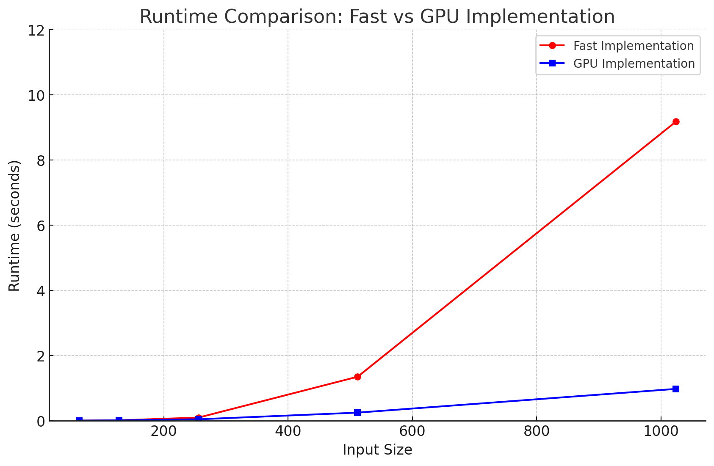

# MiniTorch Module 3


* Docs: https://minitorch.github.io/

* Overview: https://minitorch.github.io/module3.html


You will need to modify `tensor_functions.py` slightly in this assignment.

* Tests:

```
python run_tests.py
```

* Note:

Several of the tests for this assignment will only run if you are on a GPU machine and will not
run on github's test infrastructure. Please follow the instructions to setup up a colab machine
to run these tests.

This assignment requires the following files from the previous assignments. You can get these by running

```bash
python sync_previous_module.py previous-module-dir current-module-dir
```

The files that will be synced are:

        minitorch/tensor_data.py minitorch/tensor_functions.py minitorch/tensor_ops.py minitorch/operators.py minitorch/scalar.py minitorch/scalar_functions.py minitorch/module.py minitorch/autodiff.py minitorch/module.py project/run_manual.py project/run_scalar.py project/run_tensor.py minitorch/operators.py minitorch/module.py minitorch/autodiff.py minitorch/tensor.py minitorch/datasets.py minitorch/testing.py minitorch/optim.py


## Task 3.1 & 3.2
### Diagnostics Output

```console
MAP

================================================================================
 Parallel Accelerator Optimizing:  Function tensor_map.<locals>._map,
/Users/huziyao/Desktop/MLE/workspace/mod3-Mustache007/minitorch/fast_ops.py
(164)
================================================================================


Parallel loop listing for  Function tensor_map.<locals>._map, /Users/huziyao/Desktop/MLE/workspace/mod3-Mustache007/minitorch/fast_ops.py (164)
-----------------------------------------------------------------------------------------|loop #ID
    def _map(                                                                            |
        out: Storage,                                                                    |
        out_shape: Shape,                                                                |
        out_strides: Strides,                                                            |
        in_storage: Storage,                                                             |
        in_shape: Shape,                                                                 |
        in_strides: Strides,                                                             |
    ) -> None:                                                                           |
        # TODO: Implement for Task 3.1.                                                  |
        # Check if input and output tensors have same shape and strides for fast path    |
        if (np.array_equal(out_strides, in_strides)                                      |
            and np.array_equal(out_shape, in_shape)):                                    |
            # Fast path - directly map elements                                          |
            for idx in prange(out.size):-------------------------------------------------| #0
                out[idx] = fn(in_storage[idx])                                           |
        else:                                                                            |
            # Slow path - handle broadcasting                                            |
            for elem_idx in prange(out.size):--------------------------------------------| #1
                output_coords = np.empty(MAX_DIMS, np.int32)                             |
                input_coords = np.empty(MAX_DIMS, np.int32)                              |
                                                                                         |
                to_index(elem_idx, out_shape, output_coords)                             |
                                                                                         |
                broadcast_index(output_coords, out_shape, in_shape, input_coords)        |
                                                                                         |
                input_pos = index_to_position(input_coords, in_strides)                  |
                out_pos = index_to_position(output_coords, out_strides)                  |
                                                                                         |
                out[out_pos] = fn(in_storage[input_pos])                                 |
--------------------------------- Fusing loops ---------------------------------
Attempting fusion of parallel loops (combines loops with similar properties)...
Following the attempted fusion of parallel for-loops there are 2 parallel for-
loop(s) (originating from loops labelled: #0, #1).
--------------------------------------------------------------------------------
----------------------------- Before Optimisation ------------------------------
--------------------------------------------------------------------------------
------------------------------ After Optimisation ------------------------------
Parallel structure is already optimal.
--------------------------------------------------------------------------------
--------------------------------------------------------------------------------

---------------------------Loop invariant code motion---------------------------
Allocation hoisting:
The memory allocation derived from the instruction at
/Users/huziyao/Desktop/MLE/workspace/mod3-Mustache007/minitorch/fast_ops.py
(182) is hoisted out of the parallel loop labelled #1 (it will be performed
before the loop is executed and reused inside the loop):
   Allocation:: output_coords = np.empty(MAX_DIMS, np.int32)
    - numpy.empty() is used for the allocation.
The memory allocation derived from the instruction at
/Users/huziyao/Desktop/MLE/workspace/mod3-Mustache007/minitorch/fast_ops.py
(183) is hoisted out of the parallel loop labelled #1 (it will be performed
before the loop is executed and reused inside the loop):
   Allocation:: input_coords = np.empty(MAX_DIMS, np.int32)
    - numpy.empty() is used for the allocation.
None
ZIP

================================================================================
 Parallel Accelerator Optimizing:  Function tensor_zip.<locals>._zip,
/Users/huziyao/Desktop/MLE/workspace/mod3-Mustache007/minitorch/fast_ops.py
(220)
================================================================================


Parallel loop listing for  Function tensor_zip.<locals>._zip, /Users/huziyao/Desktop/MLE/workspace/mod3-Mustache007/minitorch/fast_ops.py (220)
---------------------------------------------------------------------------|loop #ID
    def _zip(                                                              |
        out: Storage,                                                      |
        out_shape: Shape,                                                  |
        out_strides: Strides,                                              |
        a_storage: Storage,                                                |
        a_shape: Shape,                                                    |
        a_strides: Strides,                                                |
        b_storage: Storage,                                                |
        b_shape: Shape,                                                    |
        b_strides: Strides,                                                |
    ) -> None:                                                             |
        # TODO: Implement for Task 3.1.                                    |
        if (                                                               |
            np.array_equal(out_strides, a_strides)                         |
            and np.array_equal(out_strides, b_strides)                     |
            and np.array_equal(out_shape, a_shape)                         |
            and np.array_equal(out_shape, b_shape)                         |
        ):                                                                 |
            for i in prange(out.size):-------------------------------------| #2
                out[i] = fn(a_storage[i], b_storage[i])                    |
        else:                                                              |
            for i in prange(out.size):-------------------------------------| #3
                out_index = np.empty(MAX_DIMS, np.int32)                   |
                a_index = np.empty(MAX_DIMS, np.int32)                     |
                b_index = np.empty(MAX_DIMS, np.int32)                     |
                to_index(i, out_shape, out_index)                          |
                broadcast_index(out_index, out_shape, a_shape, a_index)    |
                broadcast_index(out_index, out_shape, b_shape, b_index)    |
                a_pos = index_to_position(a_index, a_strides)              |
                b_pos = index_to_position(b_index, b_strides)              |
                out_pos = index_to_position(out_index, out_strides)        |
                out[out_pos] = fn(                                         |
                    a_storage[a_pos],                                      |
                    b_storage[b_pos],                                      |
                )                                                          |
--------------------------------- Fusing loops ---------------------------------
Attempting fusion of parallel loops (combines loops with similar properties)...
Following the attempted fusion of parallel for-loops there are 2 parallel for-
loop(s) (originating from loops labelled: #2, #3).
--------------------------------------------------------------------------------
----------------------------- Before Optimisation ------------------------------
--------------------------------------------------------------------------------
------------------------------ After Optimisation ------------------------------
Parallel structure is already optimal.
--------------------------------------------------------------------------------
--------------------------------------------------------------------------------

---------------------------Loop invariant code motion---------------------------
Allocation hoisting:
The memory allocation derived from the instruction at
/Users/huziyao/Desktop/MLE/workspace/mod3-Mustache007/minitorch/fast_ops.py
(242) is hoisted out of the parallel loop labelled #3 (it will be performed
before the loop is executed and reused inside the loop):
   Allocation:: out_index = np.empty(MAX_DIMS, np.int32)
    - numpy.empty() is used for the allocation.
The memory allocation derived from the instruction at
/Users/huziyao/Desktop/MLE/workspace/mod3-Mustache007/minitorch/fast_ops.py
(243) is hoisted out of the parallel loop labelled #3 (it will be performed
before the loop is executed and reused inside the loop):
   Allocation:: a_index = np.empty(MAX_DIMS, np.int32)
    - numpy.empty() is used for the allocation.
The memory allocation derived from the instruction at
/Users/huziyao/Desktop/MLE/workspace/mod3-Mustache007/minitorch/fast_ops.py
(244) is hoisted out of the parallel loop labelled #3 (it will be performed
before the loop is executed and reused inside the loop):
   Allocation:: b_index = np.empty(MAX_DIMS, np.int32)
    - numpy.empty() is used for the allocation.
None
REDUCE

================================================================================
 Parallel Accelerator Optimizing:  Function tensor_reduce.<locals>._reduce,
/Users/huziyao/Desktop/MLE/workspace/mod3-Mustache007/minitorch/fast_ops.py
(279)
================================================================================


Parallel loop listing for  Function tensor_reduce.<locals>._reduce, /Users/huziyao/Desktop/MLE/workspace/mod3-Mustache007/minitorch/fast_ops.py (279)
---------------------------------------------------------------|loop #ID
    def _reduce(                                               |
        out: Storage,                                          |
        out_shape: Shape,                                      |
        out_strides: Strides,                                  |
        a_storage: Storage,                                    |
        a_shape: Shape,                                        |
        a_strides: Strides,                                    |
        reduce_dim: int,                                       |
    ) -> None:                                                 |
        # TODO: Implement for Task 3.1.                        |
        reduce_size = a_shape[reduce_dim]                      |
        for i in prange(out.size):-----------------------------| #4
            index = np.empty(MAX_DIMS, np.int32)               |
            to_index(i, out_shape, index)                      |
            out_pos = index_to_position(index, out_strides)    |
            index[reduce_dim] = 0                              |
            pos = index_to_position(index, a_strides)          |
            acc = a_storage[pos]                               |
            for j in range(1, reduce_size):                    |
                index[reduce_dim] = j                          |
                pos = index_to_position(index, a_strides)      |
                acc = fn(acc, a_storage[pos])                  |
            out[out_pos] = acc                                 |
--------------------------------- Fusing loops ---------------------------------
Attempting fusion of parallel loops (combines loops with similar properties)...
Following the attempted fusion of parallel for-loops there are 1 parallel for-
loop(s) (originating from loops labelled: #4).
--------------------------------------------------------------------------------
----------------------------- Before Optimisation ------------------------------
--------------------------------------------------------------------------------
------------------------------ After Optimisation ------------------------------
Parallel structure is already optimal.
--------------------------------------------------------------------------------
--------------------------------------------------------------------------------

---------------------------Loop invariant code motion---------------------------
Allocation hoisting:
The memory allocation derived from the instruction at
/Users/huziyao/Desktop/MLE/workspace/mod3-Mustache007/minitorch/fast_ops.py
(291) is hoisted out of the parallel loop labelled #4 (it will be performed
before the loop is executed and reused inside the loop):
   Allocation:: index = np.empty(MAX_DIMS, np.int32)
    - numpy.empty() is used for the allocation.
None
MATRIX MULTIPLY

================================================================================
 Parallel Accelerator Optimizing:  Function _tensor_matrix_multiply,
/Users/huziyao/Desktop/MLE/workspace/mod3-Mustache007/minitorch/fast_ops.py
(306)
================================================================================


Parallel loop listing for  Function _tensor_matrix_multiply, /Users/huziyao/Desktop/MLE/workspace/mod3-Mustache007/minitorch/fast_ops.py (306)
----------------------------------------------------------------------------------------------------|loop #ID
def _tensor_matrix_multiply(                                                                        |
    out: Storage,                                                                                   |
    out_shape: Shape,                                                                               |
    out_strides: Strides,                                                                           |
    a_storage: Storage,                                                                             |
    a_shape: Shape,                                                                                 |
    a_strides: Strides,                                                                             |
    b_storage: Storage,                                                                             |
    b_shape: Shape,                                                                                 |
    b_strides: Strides,                                                                             |
) -> None:                                                                                          |
    """NUMBA tensor matrix multiply function.                                                       |
                                                                                                    |
    Should work for any tensor shapes that broadcast as long as                                     |
                                                                                                    |
    ```                                                                                             |
    assert a_shape[-1] == b_shape[-2]                                                               |
    ```                                                                                             |
                                                                                                    |
    Optimizations:                                                                                  |
                                                                                                    |
    * Outer loop in parallel                                                                        |
    * No index buffers or function calls                                                            |
    * Inner loop should have no global writes, 1 multiply.                                          |
                                                                                                    |
                                                                                                    |
    Args:                                                                                           |
    ----                                                                                            |
        out (Storage): storage for `out` tensor                                                     |
        out_shape (Shape): shape for `out` tensor                                                   |
        out_strides (Strides): strides for `out` tensor                                             |
        a_storage (Storage): storage for `a` tensor                                                 |
        a_shape (Shape): shape for `a` tensor                                                       |
        a_strides (Strides): strides for `a` tensor                                                 |
        b_storage (Storage): storage for `b` tensor                                                 |
        b_shape (Shape): shape for `b` tensor                                                       |
        b_strides (Strides): strides for `b` tensor                                                 |
                                                                                                    |
    Returns:                                                                                        |
    -------                                                                                         |
        None : Fills in `out`                                                                       |
                                                                                                    |
    """                                                                                             |
    a_batch_stride = a_strides[0] if a_shape[0] > 1 else 0                                          |
    b_batch_stride = b_strides[0] if b_shape[0] > 1 else 0                                          |
                                                                                                    |
    # TODO: Implement for Task 3.2.                                                                 |
    # Initialize local stride variables to avoid global reads                                       |
    batch_stride_out = out_strides[0] if out_shape[0] > 1 else 0                                    |
    row_stride_out = out_strides[-2]                                                                |
    col_stride_out = out_strides[-1]                                                                |
    a_batch_stride = a_strides[0] if a_shape[0] > 1 else 0                                          |
    row_stride_a = a_strides[-2]                                                                    |
    col_stride_a = a_strides[-1]                                                                    |
    b_batch_stride = b_strides[0] if b_shape[0] > 1 else 0                                          |
    col_stride_b = b_strides[-1]                                                                    |
    row_stride_b = b_strides[-2]                                                                    |
                                                                                                    |
    # Perform the matrix multiplication                                                             |
    for batch in prange(out_shape[0]):--------------------------------------------------------------| #7
        for row in prange(out_shape[-2]):-----------------------------------------------------------| #6
            for col in prange(out_shape[-1]):-------------------------------------------------------| #5
                # Calculate linear index for out tensor                                             |
                out_idx = batch * batch_stride_out + row * row_stride_out + col * col_stride_out    |
                                                                                                    |
                # Initialize starting indices for a and b tensors                                   |
                a_idx = batch * a_batch_stride + row * row_stride_a                                 |
                b_idx = batch * b_batch_stride + col * col_stride_b                                 |
                                                                                                    |
                # Accumulate the result for out tensor                                              |
                result = 0                                                                          |
                for k in range(a_shape[-1]):                                                        |
                    result += a_storage[a_idx] * b_storage[b_idx]                                   |
                    a_idx += col_stride_a  # move to next column in a                               |
                    b_idx += row_stride_b  # move to next row in b                                  |
                                                                                                    |
                out[out_idx] = result                                                               |
--------------------------------- Fusing loops ---------------------------------
Attempting fusion of parallel loops (combines loops with similar properties)...
Following the attempted fusion of parallel for-loops there are 2 parallel for-
loop(s) (originating from loops labelled: #7, #6).
--------------------------------------------------------------------------------
---------------------------- Optimising loop nests -----------------------------
Attempting loop nest rewrites (optimising for the largest parallel loops)...

+--7 is a parallel loop
   +--6 --> rewritten as a serial loop
      +--5 --> rewritten as a serial loop
--------------------------------------------------------------------------------
----------------------------- Before Optimisation ------------------------------
Parallel region 0:
+--7 (parallel)
   +--6 (parallel)
      +--5 (parallel)


--------------------------------------------------------------------------------
------------------------------ After Optimisation ------------------------------
Parallel region 0:
+--7 (parallel)
   +--6 (serial)
      +--5 (serial)


Parallel region 0 (loop #7) had 0 loop(s) fused and 2 loop(s) serialized as part
 of the larger parallel loop (#7).
--------------------------------------------------------------------------------
--------------------------------------------------------------------------------

---------------------------Loop invariant code motion---------------------------
Allocation hoisting:
No allocation hoisting found
None
```

## Task 3.4: CUDA Matrix Multiplication
```console
Timing summary
Size: 64
    fast: 0.00454
    gpu: 0.00675
Size: 128
    fast: 0.01515
    gpu: 0.01370
Size: 256
    fast: 0.09833
    gpu: 0.04630
Size: 512
    fast: 1.35155
    gpu: 0.25028
Size: 1024
    fast: 9.17821
    gpu: 0.97826
```



## Task 3.5: Training
### Small Model (HIDDEN = 100)

### Simple Dataset
#### CPU: 0.130s/epoch
```bash
!cd $DIR; PYTHONPATH=/content/$DIR python3.11 project/run_fast_tensor.py --BACKEND cpu --HIDDEN 100 --DATASET simple --RATE 0.05
```
```console
Epoch  0  loss  3.7804454288332057 correct 46
Epoch  10  loss  2.133465042099956 correct 49
Epoch  20  loss  1.2433947039882236 correct 48
Epoch  30  loss  0.6650568699250244 correct 49
Epoch  40  loss  1.7620706826242167 correct 49
Epoch  50  loss  0.6984994841390086 correct 49
Epoch  60  loss  0.5084675816216017 correct 49
Epoch  70  loss  1.8610973781364664 correct 50
Epoch  80  loss  0.5459336222380607 correct 49
Epoch  90  loss  0.08016734911547398 correct 50
Epoch  100  loss  0.2372445012834054 correct 49
Epoch  110  loss  0.8603975412051024 correct 50
Epoch  120  loss  0.7976329029095005 correct 49
Epoch  130  loss  1.2015003620539788 correct 50
Epoch  140  loss  0.427121980793152 correct 50
Epoch  150  loss  0.04617179487855459 correct 50
Epoch  160  loss  0.022375273226995784 correct 50
Epoch  170  loss  0.15883528866941535 correct 50
Epoch  180  loss  0.710470398148191 correct 50
Epoch  190  loss  0.06849157514875176 correct 50
Epoch  200  loss  0.43524691295500406 correct 50
Epoch  210  loss  0.01698089183724119 correct 50
Epoch  220  loss  0.03183365012907555 correct 50
Epoch  230  loss  0.004013984329882804 correct 50
Epoch  240  loss  0.658044330196808 correct 50
Epoch  250  loss  0.5617027503227285 correct 50
Epoch  260  loss  0.1578665103397501 correct 50
Epoch  270  loss  0.5212656829549753 correct 50
Epoch  280  loss  0.5717460779395852 correct 50
Epoch  290  loss  0.07568934647280463 correct 50
Epoch  300  loss  0.3250546731840668 correct 50
Epoch  310  loss  0.6269660338031989 correct 50
Epoch  320  loss  0.5079515019742359 correct 50
Epoch  330  loss  0.4795709868712683 correct 50
Epoch  340  loss  0.48629835864464416 correct 50
Epoch  350  loss  0.0682706833840605 correct 50
Epoch  360  loss  0.010842037126909032 correct 50
Epoch  370  loss  0.023795524670483428 correct 50
Epoch  380  loss  0.03777571735983424 correct 50
Epoch  390  loss  0.09579193276192932 correct 50
Epoch  400  loss  0.11462492922801978 correct 50
Epoch  410  loss  0.29067490630906995 correct 50
Epoch  420  loss  0.03225692788934231 correct 50
Epoch  430  loss  0.05525825318866126 correct 50
Epoch  440  loss  0.3337587290964841 correct 50
Epoch  450  loss  0.002177062417822245 correct 50
Epoch  460  loss  0.029511291467762633 correct 50
Epoch  470  loss  0.04491223234774393 correct 50
Epoch  480  loss  0.2527996843004503 correct 50
Epoch  490  loss  0.08205919547807573 correct 50
Time per epoch: 0.12994496726989746 seconds
```

#### GPU: 1.345s/epoch
```bash
!cd $DIR; PYTHONPATH=/content/$DIR python3.11 project/run_fast_tensor.py --BACKEND gpu --HIDDEN 100 --DATASET simple --RATE 0.05
```
```console
Epoch  0  loss  4.551262512359475 correct 43
Epoch  10  loss  1.6433801960192358 correct 48
Epoch  20  loss  1.3636819088050292 correct 50
Epoch  30  loss  1.2929092355142997 correct 50
Epoch  40  loss  0.7640225959654534 correct 50
Epoch  50  loss  0.3965032619880503 correct 50
Epoch  60  loss  1.0637437752203731 correct 50
Epoch  70  loss  0.4622730979121836 correct 50
Epoch  80  loss  0.5462748475593229 correct 50
Epoch  90  loss  0.9208394840485276 correct 50
Epoch  100  loss  0.06594283324543017 correct 50
Epoch  110  loss  0.2750083475393769 correct 50
Epoch  120  loss  0.8292648071325703 correct 50
Epoch  130  loss  0.07752880966500252 correct 50
Epoch  140  loss  0.4523586538520151 correct 50
Epoch  150  loss  0.02428559354805281 correct 50
Epoch  160  loss  0.4347470484082998 correct 50
Epoch  170  loss  0.2904034554900082 correct 50
Epoch  180  loss  0.3047891595783277 correct 50
Epoch  190  loss  0.36930540733462075 correct 50
Epoch  200  loss  0.26583452477254554 correct 50
Epoch  210  loss  0.13125575339083784 correct 50
Epoch  220  loss  0.0041818070020361595 correct 50
Epoch  230  loss  0.007843766689904464 correct 50
Epoch  240  loss  0.0085861793699433 correct 50
Epoch  250  loss  0.088925728345894 correct 50
Epoch  260  loss  0.0901904852374124 correct 50
Epoch  270  loss  0.1686960764436073 correct 50
Epoch  280  loss  0.13350664245295077 correct 50
Epoch  290  loss  0.1146773082200884 correct 50
Epoch  300  loss  0.1557140369957979 correct 50
Epoch  310  loss  0.39772717329141516 correct 50
Epoch  320  loss  0.22077695750806126 correct 50
Epoch  330  loss  0.15726195161436143 correct 50
Epoch  340  loss  0.12954179456572887 correct 50
Epoch  350  loss  0.021416052618855458 correct 50
Epoch  360  loss  0.1606630565392175 correct 50
Epoch  370  loss  0.00443342866680509 correct 50
Epoch  380  loss  0.11291003362416797 correct 50
Epoch  390  loss  0.0046631764642871805 correct 50
Epoch  400  loss  0.11275163418216377 correct 50
Epoch  410  loss  0.0630808446897338 correct 50
Epoch  420  loss  0.028666173978729503 correct 50
Epoch  430  loss  0.04981881500402084 correct 50
Epoch  440  loss  0.001993289452746112 correct 50
Epoch  450  loss  0.008783781071886428 correct 50
Epoch  460  loss  0.08442587330064667 correct 50
Epoch  470  loss  0.10982786310195215 correct 50
Epoch  480  loss  0.1437249824172667 correct 50
Epoch  490  loss  0.08829899498793375 correct 50
Time per epoch: 1.3450724835395813 seconds
```


### XOR Dataset
#### CPU: 0.127s/epoch
```bash
!cd $DIR; PYTHONPATH=/content/$DIR python3.11 project/run_fast_tensor.py --BACKEND cpu --HIDDEN 100 --DATASET xor --RATE 0.05
```
```console
Epoch  0  loss  6.808178129869903 correct 33
Epoch  10  loss  5.606862250225091 correct 43
Epoch  20  loss  4.598852112367798 correct 42
Epoch  30  loss  4.73205940681039 correct 44
Epoch  40  loss  4.472485665667733 correct 47
Epoch  50  loss  3.867118506706003 correct 49
Epoch  60  loss  2.6548377689956366 correct 49
Epoch  70  loss  1.6088613738669242 correct 45
Epoch  80  loss  1.1069630541282685 correct 45
Epoch  90  loss  3.9699317825691143 correct 48
Epoch  100  loss  1.8379055466392684 correct 50
Epoch  110  loss  2.246527166330805 correct 50
Epoch  120  loss  1.779397421149162 correct 48
Epoch  130  loss  5.895340309768525 correct 45
Epoch  140  loss  1.3231231987115504 correct 49
Epoch  150  loss  1.4947437811732618 correct 50
Epoch  160  loss  0.6313466431929209 correct 50
Epoch  170  loss  0.8210955966744933 correct 50
Epoch  180  loss  1.114902826578629 correct 50
Epoch  190  loss  1.5365057271435014 correct 49
Epoch  200  loss  0.6764731804932487 correct 50
Epoch  210  loss  0.40665287610093703 correct 50
Epoch  220  loss  0.08950818190145997 correct 50
Epoch  230  loss  0.47766088103078386 correct 50
Epoch  240  loss  0.5887132221923379 correct 50
Epoch  250  loss  0.0696672919969733 correct 50
Epoch  260  loss  0.6986216634778171 correct 50
Epoch  270  loss  0.5673805548096453 correct 50
Epoch  280  loss  0.5350447626898228 correct 50
Epoch  290  loss  0.8950814400445659 correct 50
Epoch  300  loss  0.6154876085683499 correct 50
Epoch  310  loss  0.3104573764289522 correct 50
Epoch  320  loss  0.2694539721639332 correct 50
Epoch  330  loss  0.2828006894690707 correct 50
Epoch  340  loss  0.8357730044498407 correct 50
Epoch  350  loss  0.4613394018048709 correct 50
Epoch  360  loss  0.3595773330650158 correct 50
Epoch  370  loss  0.7225553307046836 correct 50
Epoch  380  loss  0.44073109458999393 correct 50
Epoch  390  loss  0.1723505090600084 correct 50
Epoch  400  loss  0.3498932182716383 correct 50
Epoch  410  loss  0.12326028026949927 correct 50
Epoch  420  loss  0.3916264030833549 correct 50
Epoch  430  loss  0.37370089228701436 correct 50
Epoch  440  loss  0.26716924001715164 correct 50
Epoch  450  loss  0.7860433761314395 correct 50
Epoch  460  loss  0.5109517794538111 correct 50
Epoch  470  loss  0.30854653927551356 correct 50
Epoch  480  loss  0.10808633427951535 correct 50
Epoch  490  loss  0.11721799825248157 correct 50
Time per epoch: 0.127318265914917 seconds
```
#### GPU: 1.375s/epoch
```bash
!cd $DIR; PYTHONPATH=/content/$DIR python3.11 project/run_fast_tensor.py --BACKEND gpu --HIDDEN 100 --DATASET xor --RATE 0.05
```
```console
Epoch  0  loss  9.283491973440837 correct 26
Epoch  10  loss  4.920270445273282 correct 38
Epoch  20  loss  4.3249379993187524 correct 41
Epoch  30  loss  3.9321714305833924 correct 44
Epoch  40  loss  3.693636838230878 correct 42
Epoch  50  loss  2.7921487800272486 correct 46
Epoch  60  loss  3.4914447325945797 correct 45
Epoch  70  loss  3.2084538335954185 correct 45
Epoch  80  loss  2.300633008610587 correct 46
Epoch  90  loss  2.731396548464934 correct 46
Epoch  100  loss  2.3145382513475297 correct 47
Epoch  110  loss  2.7140431892905816 correct 45
Epoch  120  loss  1.480094854836212 correct 48
Epoch  130  loss  1.8943735755585551 correct 47
Epoch  140  loss  2.3567441658682737 correct 48
Epoch  150  loss  2.5652253044141586 correct 50
Epoch  160  loss  1.1780200171697763 correct 50
Epoch  170  loss  0.610563305939316 correct 48
Epoch  180  loss  1.0890584941479478 correct 48
Epoch  190  loss  1.8039232825950036 correct 50
Epoch  200  loss  1.4133157476042877 correct 49
Epoch  210  loss  1.4192688826491753 correct 50
Epoch  220  loss  1.2392246446825905 correct 50
Epoch  230  loss  0.3926597599061007 correct 49
Epoch  240  loss  1.109819841367062 correct 48
Epoch  250  loss  1.4758177163166453 correct 49
Epoch  260  loss  0.557695683454132 correct 50
Epoch  270  loss  0.5911136250483672 correct 49
Epoch  280  loss  1.0403574421443764 correct 50
Epoch  290  loss  1.2426140005744741 correct 48
Epoch  300  loss  0.2801905504841824 correct 50
Epoch  310  loss  0.2478977582374397 correct 50
Epoch  320  loss  2.2595391344515567 correct 48
Epoch  330  loss  1.4630570546858621 correct 47
Epoch  340  loss  1.2305198429868534 correct 50
Epoch  350  loss  0.7808621708608632 correct 48
Epoch  360  loss  0.4182274286760627 correct 48
Epoch  370  loss  1.822733635643159 correct 48
Epoch  380  loss  1.2641241623395585 correct 50
Epoch  390  loss  0.8878413147220717 correct 50
Epoch  400  loss  0.12801987404198523 correct 48
Epoch  410  loss  0.19237310561938537 correct 50
Epoch  420  loss  1.136951934696951 correct 48
Epoch  430  loss  0.02541090806240808 correct 50
Epoch  440  loss  0.4333432551316295 correct 50
Epoch  450  loss  0.7193871594892316 correct 50
Epoch  460  loss  1.0815686993683173 correct 50
Epoch  470  loss  0.17290725024705397 correct 49
Epoch  480  loss  0.9133343725938464 correct 50
Epoch  490  loss  0.7513894143618212 correct 50
Time per epoch: 1.3746589879989624 seconds
```

### Split Dataset
#### CPU: 0.128s/epoch
```bash
!cd $DIR; PYTHONPATH=/content/$DIR python3.11 project/run_fast_tensor.py --BACKEND cpu --HIDDEN 100 --DATASET split --RATE 0.05
```
```console
Epoch  0  loss  6.870783065146076 correct 36
Epoch  10  loss  7.600520496528581 correct 36
Epoch  20  loss  4.836848042920285 correct 44
Epoch  30  loss  3.5730245256401636 correct 45
Epoch  40  loss  2.4885697538028055 correct 47
Epoch  50  loss  2.3436349365082614 correct 49
Epoch  60  loss  1.3412221786738259 correct 49
Epoch  70  loss  1.272266869736066 correct 49
Epoch  80  loss  1.9166260481906698 correct 49
Epoch  90  loss  0.6195711656654076 correct 49
Epoch  100  loss  0.7294091783076607 correct 50
Epoch  110  loss  0.29871035837749355 correct 50
Epoch  120  loss  0.4724964490990047 correct 50
Epoch  130  loss  0.4859347119474158 correct 50
Epoch  140  loss  0.7405404930079359 correct 50
Epoch  150  loss  0.6917979871584569 correct 50
Epoch  160  loss  0.4041853414841463 correct 50
Epoch  170  loss  0.5149312104718243 correct 50
Epoch  180  loss  0.3550477019119384 correct 50
Epoch  190  loss  0.4583448702462498 correct 50
Epoch  200  loss  0.5457251562313606 correct 50
Epoch  210  loss  0.13839120539517685 correct 50
Epoch  220  loss  0.31484625061492016 correct 50
Epoch  230  loss  0.28974065348829986 correct 50
Epoch  240  loss  0.21076933833487357 correct 50
Epoch  250  loss  0.07417374642564546 correct 50
Epoch  260  loss  0.17806071068993293 correct 50
Epoch  270  loss  0.13631318379381102 correct 50
Epoch  280  loss  0.18493779223819296 correct 50
Epoch  290  loss  0.11760583690269161 correct 50
Epoch  300  loss  0.11614645059929664 correct 50
Epoch  310  loss  0.06948292088441017 correct 50
Epoch  320  loss  0.21346999329423658 correct 50
Epoch  330  loss  0.08310793203924677 correct 50
Epoch  340  loss  0.058142844869887855 correct 50
Epoch  350  loss  0.09437406258307249 correct 50
Epoch  360  loss  0.06490707570890641 correct 50
Epoch  370  loss  0.16448879286127932 correct 50
Epoch  380  loss  0.05406301089940298 correct 50
Epoch  390  loss  0.10432303471865616 correct 50
Epoch  400  loss  0.027751529016522516 correct 50
Epoch  410  loss  0.08833255228969417 correct 50
Epoch  420  loss  0.1000920969315941 correct 50
Epoch  430  loss  0.146474056758337 correct 50
Epoch  440  loss  0.1602217898987044 correct 50
Epoch  450  loss  0.026880823631537803 correct 50
Epoch  460  loss  0.016447091157425948 correct 50
Epoch  470  loss  0.07006660757655954 correct 50
Epoch  480  loss  0.0250566561499928 correct 50
Epoch  490  loss  0.04702058630078294 correct 50
Time per epoch: 0.1280741410255432 seconds
```

#### GPU: 1.372s/epoch
```bash
!cd $DIR; PYTHONPATH=/content/$DIR python3.11 project/run_fast_tensor.py --BACKEND gpu --HIDDEN 100 --DATASET split --RATE 0.05
```
```console
Epoch  0  loss  8.116765494381228 correct 22
Epoch  10  loss  4.190689606404826 correct 44
Epoch  20  loss  4.656970356202711 correct 40
Epoch  30  loss  2.297279241037258 correct 43
Epoch  40  loss  4.4361238432944425 correct 43
Epoch  50  loss  7.040921874921236 correct 49
Epoch  60  loss  2.7967588914724586 correct 45
Epoch  70  loss  3.6172183301335816 correct 49
Epoch  80  loss  1.909220749167185 correct 48
Epoch  90  loss  4.229952111132567 correct 48
Epoch  100  loss  2.091429303837488 correct 48
Epoch  110  loss  3.1296667584546034 correct 48
Epoch  120  loss  1.6259042594199349 correct 49
Epoch  130  loss  1.943454318505171 correct 50
Epoch  140  loss  1.8367815642718401 correct 48
Epoch  150  loss  1.2573083087212302 correct 48
Epoch  160  loss  0.7071249999260197 correct 49
Epoch  170  loss  2.4539370726548304 correct 46
Epoch  180  loss  0.8580621337250585 correct 50
Epoch  190  loss  2.2892394187367513 correct 47
Epoch  200  loss  1.4900785211584155 correct 46
Epoch  210  loss  2.9398376492727714 correct 47
Epoch  220  loss  1.5361378837686028 correct 50
Epoch  230  loss  1.5439890014186992 correct 50
Epoch  240  loss  0.1557510082310155 correct 48
Epoch  250  loss  0.926028466545872 correct 50
Epoch  260  loss  0.39216367349302694 correct 48
Epoch  270  loss  1.3767294479597376 correct 50
Epoch  280  loss  2.1552242816579286 correct 48
Epoch  290  loss  1.1166417092749745 correct 49
Epoch  300  loss  0.06434526409512596 correct 47
Epoch  310  loss  0.15418566593960917 correct 50
Epoch  320  loss  0.99601244229579 correct 49
Epoch  330  loss  0.2783347632317911 correct 50
Epoch  340  loss  0.48218856407030214 correct 50
Epoch  350  loss  0.9823360453476133 correct 50
Epoch  360  loss  0.8403878677393087 correct 50
Epoch  370  loss  1.7248074966447433 correct 48
Epoch  380  loss  3.357823431990178 correct 46
Epoch  390  loss  0.336667478299875 correct 48
Epoch  400  loss  0.7428154078613071 correct 50
Epoch  410  loss  2.661686579780505 correct 47
Epoch  420  loss  0.3383730797882303 correct 47
Epoch  430  loss  0.20614248070866226 correct 47
Epoch  440  loss  0.031753194251764615 correct 48
Epoch  450  loss  0.19084477423239393 correct 49
Epoch  460  loss  0.8080993930843623 correct 50
Epoch  470  loss  1.6179914969479934 correct 48
Epoch  480  loss  0.3882599136932786 correct 50
Epoch  490  loss  0.3709475270964408 correct 50
Time per epoch: 1.3721165046691894 seconds
```


### Large Model (HIDDEN = 200)
### Simple Dataset
#### CPU: 0.239s/epoch
```bash
!cd $DIR; PYTHONPATH=/content/$DIR python3.11 project/run_fast_tensor.py --BACKEND cpu --HIDDEN 200 --DATASET simple --RATE 0.05
```
```console
Epoch  0  loss  3.0579806295462992 correct 39
Epoch  10  loss  0.3338448082440888 correct 50
Epoch  20  loss  0.5988922549627083 correct 49
Epoch  30  loss  1.0353757328140414 correct 50
Epoch  40  loss  0.6159498211887877 correct 50
Epoch  50  loss  1.1715920580171355 correct 50
Epoch  60  loss  0.7326202924279263 correct 50
Epoch  70  loss  1.5087021869385575 correct 48
Epoch  80  loss  0.8524420231535585 correct 50
Epoch  90  loss  2.2341738439003658 correct 46
Epoch  100  loss  0.9819882291765873 correct 47
Epoch  110  loss  0.10684019627831136 correct 47
Epoch  120  loss  1.7799183882657335 correct 46
Epoch  130  loss  0.37198820755158823 correct 50
Epoch  140  loss  0.015561520464473773 correct 50
Epoch  150  loss  0.6242997834276609 correct 50
Epoch  160  loss  0.05307854123673819 correct 50
Epoch  170  loss  0.49293024730804513 correct 50
Epoch  180  loss  0.5888396708700101 correct 50
Epoch  190  loss  0.9358183908876582 correct 48
Epoch  200  loss  0.603429857256669 correct 50
Epoch  210  loss  0.3685875862196588 correct 50
Epoch  220  loss  0.3826631586695841 correct 50
Epoch  230  loss  0.3372825450140568 correct 50
Epoch  240  loss  0.07167051656586065 correct 48
Epoch  250  loss  0.04199402075102171 correct 50
Epoch  260  loss  0.19619248448345156 correct 49
Epoch  270  loss  0.010557002277919902 correct 50
Epoch  280  loss  0.27483913573811614 correct 50
Epoch  290  loss  0.003014525837556404 correct 50
Epoch  300  loss  0.0102332369492111 correct 50
Epoch  310  loss  0.23011723412610424 correct 50
Epoch  320  loss  0.181588303483654 correct 50
Epoch  330  loss  0.12420863740522829 correct 50
Epoch  340  loss  0.10108398805269551 correct 50
Epoch  350  loss  0.6175911243226366 correct 50
Epoch  360  loss  0.08612179508878998 correct 50
Epoch  370  loss  0.24684980315130686 correct 50
Epoch  380  loss  0.00039702440281429315 correct 50
Epoch  390  loss  0.0004790889237917069 correct 50
Epoch  400  loss  0.1656458035333949 correct 50
Epoch  410  loss  0.10345319077793255 correct 50
Epoch  420  loss  0.2266723407912924 correct 50
Epoch  430  loss  0.08570867341064582 correct 50
Epoch  440  loss  0.18055759680333094 correct 50
Epoch  450  loss  0.0658611718772495 correct 50
Epoch  460  loss  0.006937109412603092 correct 50
Epoch  470  loss  0.3712585537978721 correct 50
Epoch  480  loss  0.22349155382595193 correct 50
Epoch  490  loss  0.0030657151265860425 correct 50
Time per epoch: 0.23936094951629638 seconds
```
#### GPU: 1.375s/epoch
```bash
!cd $DIR; PYTHONPATH=/content/$DIR python3.11 project/run_fast_tensor.py --BACKEND gpu --HIDDEN 200 --DATASET simple --RATE 0.05
```
```console
Epoch  0  loss  4.521487114672359 correct 36
Epoch  10  loss  0.4566493262775304 correct 50
Epoch  20  loss  0.2982972453005137 correct 50
Epoch  30  loss  0.04710928058805892 correct 49
Epoch  40  loss  0.4855160702968349 correct 50
Epoch  50  loss  0.652791234367044 correct 50
Epoch  60  loss  0.507682327175695 correct 50
Epoch  70  loss  0.39906941012084063 correct 50
Epoch  80  loss  0.02865661651241732 correct 50
Epoch  90  loss  0.13460063289699897 correct 50
Epoch  100  loss  0.3093786583381109 correct 50
Epoch  110  loss  0.430213082389187 correct 50
Epoch  120  loss  0.3917762290484041 correct 50
Epoch  130  loss  0.14346895661082554 correct 50
Epoch  140  loss  0.23203895517043152 correct 50
Epoch  150  loss  0.49180965645768293 correct 50
Epoch  160  loss  0.29271449508119757 correct 50
Epoch  170  loss  0.23370140820492774 correct 50
Epoch  180  loss  0.15243083703644425 correct 50
Epoch  190  loss  0.03318848990511636 correct 50
Epoch  200  loss  0.011948717652727522 correct 50
Epoch  210  loss  0.08072578902488615 correct 50
Epoch  220  loss  0.22399968832815562 correct 50
Epoch  230  loss  0.01126845289523591 correct 50
Epoch  240  loss  0.0676525966857495 correct 50
Epoch  250  loss  0.31856074188676037 correct 50
Epoch  260  loss  0.2318968058301426 correct 50
Epoch  270  loss  0.05836833251786859 correct 50
Epoch  280  loss  0.001522834221472935 correct 50
Epoch  290  loss  0.002112355424779438 correct 50
Epoch  300  loss  0.09630695116786345 correct 50
Epoch  310  loss  0.14093449164289795 correct 50
Epoch  320  loss  7.791217616315571e-06 correct 50
Epoch  330  loss  0.1265196021245111 correct 50
Epoch  340  loss  0.03200485852102825 correct 50
Epoch  350  loss  0.14315125570199344 correct 50
Epoch  360  loss  0.03524050172192034 correct 50
Epoch  370  loss  0.16213520564430323 correct 50
Epoch  380  loss  0.1095738438834558 correct 50
Epoch  390  loss  0.1255895546466069 correct 50
Epoch  400  loss  0.021815087611759224 correct 50
Epoch  410  loss  0.17596326453998262 correct 50
Epoch  420  loss  0.00016215023965591296 correct 50
Epoch  430  loss  0.18917561894993792 correct 50
Epoch  440  loss  0.09651682726447668 correct 50
Epoch  450  loss  0.21026779646905616 correct 50
Epoch  460  loss  -1.334135123977796e-06 correct 50
Epoch  470  loss  0.09297020090094943 correct 50
Epoch  480  loss  0.0090730575709885 correct 50
Epoch  490  loss  0.049373753775344247 correct 50
Time per epoch: 1.3747119908332825 seconds
```

